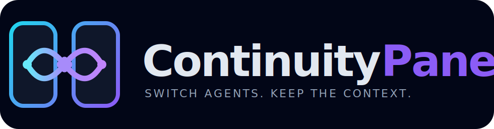

<p align="center">
  
</p>

A native, local-first macOS control panel for orchestrating cloud-powered coding agents without coupling project continuity to one provider or chat session.

ContinuityPanel.app installs [Builderz Labs Mission Control](https://github.com/builderz-labs/mission-control), keeps agent installations isolated under the current user's Application Support folder, and gives every project a durable Git-based handoff file. It is an orchestration environment, not an operating-system distribution.

> Status: early-stage community project. Mission Control itself is alpha software; back up important projects and review changes before production use.

## What it provides

- Native SwiftUI app for installation, status, agents, cloud providers, and projects.
- Mission Control dashboard and first-time setup embedded directly in the native app.
- One-click graphical installation with no Docker, Homebrew, or remote server.
- Pinned, reproducible versions of Mission Control and local runtimes.
- Built-in installer catalog for Codex, Hermes, Claude Code, Gemini CLI, GitHub Copilot CLI, OpenCode, goose, Aider, Qwen Code, and Kimi Code; automated Mission Control dispatch currently supports Codex and Hermes.
- Per-agent Codex model and reasoning selection, populated from the authenticated Codex CLI catalog.
- Dynamic Hermes provider catalog sourced from the installed Hermes version, including API keys, OAuth accounts, cloud subscriptions, AWS, Vertex AI, local services, and custom endpoints.
- Multiple isolated Hermes profiles, each permanently bound to its own provider and model, with reusable provider credentials from macOS Keychain.
- Resilient Hermes execution with activity-aware timeouts, visible progress, provider-error detection, and exponential retry backoff.
- Automatic Hermes update checks at app launch, with user-confirmed Stable or experimental Latest/Main installation and pre-update backups.
- Working task controls in the embedded dashboard: stop active Codex/Hermes runs and delete tasks safely after confirmation.
- Local Mission Control service managed by `launchd`.
- Shared `AGENTS.md` and `PROJECT_STATE.md` protocol for agent handoff.
- Safe project import that preserves hidden files and Git history, with optional automatic analysis by any configured agent.
- Cloud-provider secrets stored in the current user's macOS Keychain.
- No bundled models and no credentials committed to Git.

## Requirements

- macOS on Apple Silicon or Intel.
- Internet access.
- Apple Command Line Tools. ContinuityPanel detects them and Git; macOS can install them on demand.
- Cloud subscriptions or API credentials for whichever agents/models you choose.

## Install the app

Download `ContinuityPanel-0.6.3-macos.zip` from the GitHub Releases page, move `ContinuityPanel.app` to Applications, and open it. On first use:

1. Select **Install Environment** in the app.
2. Create the local Mission Control administrator when the embedded setup appears.
3. Add the agents you want under **Agents & Models**.
4. Sign in to Codex or create Hermes profiles for the cloud providers and models you want.
5. Create a local project, or use **Import Existing Project** to copy an existing application into ContinuityPanel.

The app never sends a project to the ContinuityPanel maintainer's GitHub account. New projects remain local until their owner explicitly chooses a GitHub account, repository, organization, and visibility.

> The current community build is ad-hoc signed. Until a notarized Developer ID build is available, macOS may require **Control-click → Open** on first launch.

## Build from source

Contributors can clone the source anywhere, then build and run the native app:

```bash
cd ~
git clone https://github.com/soundflow-dev/continuity-panel.git
cd continuity-panel
./script/build_and_run.sh
```

Create the distributable zip with:

```bash
./script/build_and_run.sh --package
```

The app copies its bundled installation engine to `~/Library/Application Support/ContinuityPanel`, downloads Node.js, installs pnpm, checks out Mission Control v2.1.0, builds it, and registers a user-level macOS service. Mission Control starts immediately and is started automatically whenever you log in. It does not require administrator access.

## Add agents

Agents are added from the **Agents & Models** screen. The command-line engine remains available for diagnostics and contributors:

```bash
./bin/add-agent codex
./bin/add-agent hermes
```

The graphical interface handles agent installation, Codex browser login, per-agent Codex model selection, Hermes profiles, provider/model configuration, and reusable provider credentials. Equivalent diagnostic commands include:

```bash
./bin/codex login
./bin/hermes model
```

Agent credentials and sessions live in the isolated Application Support environment. Reusable cloud API keys are stored in the macOS Keychain. They are never part of this repository. Adding a future agent means extending the declarative app catalog and its isolated installer adapter.

### Create local Mission Control agents

After installing and authenticating a runtime, open **Mission Control → Agents → Add Agent**:

1. Choose a role template such as **Developer**.
2. Select **Codex CLI** or **Hermes Agent** as the runtime.
3. Give the agent a name and keep workspace access on read/write for development work.
4. For Codex, choose the account default or a model and reasoning effort from the installed CLI's live catalog.
5. Review and create it. Local Codex/Hermes agents do not require an OpenClaw gateway.

Assigned tasks run through the selected CLI. Codex uses its existing ChatGPT/OpenAI login and the model stored on that Mission Control agent; Hermes uses the provider and model selected in ContinuityPanel. When a task belongs to a Mission Control project whose name or slug matches a folder under `projects/`, execution uses that project as its working directory.

> Current limitation: Claude Code, Gemini CLI, Copilot CLI, OpenCode, goose, Aider, Qwen Code, and Kimi Code can be installed from the catalog, but they do not yet have ContinuityPanel task-dispatch adapters. Cloud-provider credentials outside Hermes are not yet used by the task dispatcher.

### Hermes profiles

Open **Agents & Models → Hermes Agent → Manage profiles**. Create one profile for every provider/model combination you want available, for example:

- `GLM 5.2 NVIDIA` → NVIDIA NIM → `z-ai/glm-5.2`
- `Qwen NVIDIA` → NVIDIA NIM → a supported Qwen model
- `MiMo` → Xiaomi MiMo → a supported MiMo model

ContinuityPanel creates a matching Mission Control agent automatically. Assigning a task to that agent selects its Hermes profile, so no global model switching is required. Profiles keep configuration, sessions, state, and memory separate while using the same Hermes installation.

API credentials are saved by provider and field in macOS Keychain. When another profile uses the same provider, leave its credential field empty to reuse the saved key. Existing credentials from the original shared Hermes configuration are migrated to Keychain when first reused. All profiles using the same key also share that provider account's quota and rate limits.

Long Hermes jobs are monitored through profile activity rather than being stopped after a fixed ten minutes. The default inactivity limit is 15 minutes and the hard runtime limit is 45 minutes; advanced users can override them with `MC_HERMES_INACTIVITY_TIMEOUT_MS` and `MC_HERMES_MAX_RUNTIME_MS` in Mission Control's `.env`. HTTP 429 and provider 5xx responses are recorded as failures and retried with exponential backoff instead of being presented as completed work. In local mode, quality review prefers the authenticated Codex CLI and falls back to another configured runtime.

Use **Manage Profiles → Remove…** to remove a named profile. ContinuityPanel refuses removal while its agent has active work, hides the corresponding Mission Control agent, and moves the profile directory to the macOS Trash. Shared provider credentials remain in Keychain because other profiles may still use them. The original shared/default Hermes configuration is preserved.

### Hermes updates

ContinuityPanel checks the official Hermes Git repository once whenever the app opens. If newer code exists, it displays a notice and an update badge under **Agents & Models → Hermes Agent**. Updates are never installed automatically.

Select **Update…** to choose a channel:

- **Stable** is recommended and follows published Hermes releases.
- **Latest / Main** follows the newest upstream code and can contain fixes before the next release, but may also introduce regressions.

Before changing Hermes, ContinuityPanel refuses to proceed while a Hermes task is active and saves a restricted-permission backup under its Application Support folder. If dependency installation fails, it restores the previous Hermes revision. Projects and Mission Control tasks are not changed by a Hermes update.

The update window streams the Hermes command output live, automatically follows new lines, and keeps the complete progress log visible after success or failure for diagnosis.

## Mission Control service

After installation, Mission Control runs automatically at login. You do not need to run a start command after restarting the Mac. These commands are optional diagnostics from the installed engine directory.

```bash
./bin/start
./bin/status
./bin/stop
```

Use `start` to restart it manually, `status` to check it, and `stop` to stop it for the current login session. Because automatic startup remains enabled, a service stopped manually will run again the next time you log in. Keep the ContinuityPanel folder in the same location after installation because the registered service uses its absolute path.

Open **Mission Control** in the ContinuityPanel sidebar. Its first-time setup and dashboard are displayed inside the app; opening a localhost URL manually is not required.

## Create an application

```bash
./bin/new-project my-app
cd projects/my-app
```

The command initializes Git, registers the project in Mission Control, and adds:

- `AGENTS.md`: durable rules shared by all coding agents.
- `PROJECT_STATE.md`: objective, decisions, completed work, verification, risks, and the exact next action.

Projects can be moved safely to the macOS Trash from the app. This archives the corresponding Mission Control project but never removes a GitHub repository.

### Import an existing application

Open **Projects → Import Existing Project…** and choose the application folder. ContinuityPanel:

- copies the complete folder while leaving the original untouched;
- preserves hidden files, Git history, and existing handoff documentation;
- creates `AGENTS.md`, `PROJECT_STATE.md`, and a Git repository only when they are missing;
- registers the copied project in Mission Control;
- can assign a read-only initial analysis to any configured Mission Control agent.

Automatic analysis updates `PROJECT_STATE.md` with the detected objective, stack, architecture, run and test commands, Git state, risks, and the recommended next task. By default it does not install dependencies, execute tests, or change application code. **Run existing tests when safe** is an explicit opt-in and still does not permit dependency installation.

Commit both files with the application and give each application its own GitHub repository. This is what allows Codex, Hermes, or another agent to resume work without depending on another provider's conversation history.

## Reinstall after formatting a Mac

1. Download and install ContinuityPanel.app again.
2. Allow macOS to install Command Line Tools if requested.
3. Select **Install Environment** and add the desired agents in the GUI.
4. Authenticate cloud accounts again.
5. Clone each application from its owner's GitHub account or organization.

Downloaded dependencies do not need to be backed up. Mission Control history and local agent sessions are runtime data; if you need them, back them up separately to encrypted storage. Never commit them to this repository.

## Directory layout

```text
continuity-panel/
├── Sources/             # native SwiftUI application
├── Tests/               # native application tests
├── Packaging/           # bundle metadata and app icon
├── script/              # build, run, and package entrypoint
├── bin/                 # isolated service, agent, and project engine
├── config/              # launchd service template
├── helpers/             # non-interactive configuration adapters
├── patches/             # pinned Mission Control interoperability patches
├── templates/           # agent and project handoff defaults
├── install.sh           # reproducible engine installer
├── mission-control/     # downloaded upstream source; ignored
├── runtime/             # downloaded Node, Python and uv; ignored
├── home/                # credentials, sessions and agent state; ignored
├── tools/               # optional installed agents; ignored
└── projects/            # independent application repositories; ignored here
```

## Security

- Do not commit `.env`, API keys, OAuth tokens, session databases, Mission Control `.data`, or the isolated `home/` directory.
- The dashboard binds to `127.0.0.1` by default. Do not expose it publicly without TLS, host restrictions, and a security review.
- Review upstream release notes before changing pinned versions.
- See [SECURITY.md](SECURITY.md) before reporting a vulnerability.

## Upstream projects

This repository automates installation and interoperability; it does not redistribute or replace the upstream projects:

### Mission Control credit

ContinuityPanel uses and integrates [Mission Control](https://github.com/builderz-labs/mission-control), the open-source AI-agent orchestration dashboard created and maintained by **Builderz Labs**. The Mission Control interface, orchestration foundation, and upstream source belong to their original authors and contributors. ContinuityPanel is an independent community integration and is not presented as the creator or owner of Mission Control.

Mission Control is licensed under the MIT License, copyright © 2026 Builderz Labs. See [THIRD_PARTY_NOTICES.md](THIRD_PARTY_NOTICES.md) for the attribution and license notice included with this project.

- [Builderz Labs Mission Control](https://github.com/builderz-labs/mission-control)
- [Nous Research Hermes Agent](https://github.com/NousResearch/hermes-agent)
- [OpenAI Codex](https://developers.openai.com/codex/cli/)

Each upstream project retains its own trademarks, copyright, license, release process, and support policy.

## Contributing

Community contributions are welcome. See [CONTRIBUTING.md](CONTRIBUTING.md). The most useful next modules are additional CLI agents, encrypted state backup, upgrade/rollback commands, and automated end-to-end handoff tests.

## License

The original files in this repository are available under the [MIT License](LICENSE). Installed upstream components remain under their respective licenses.
